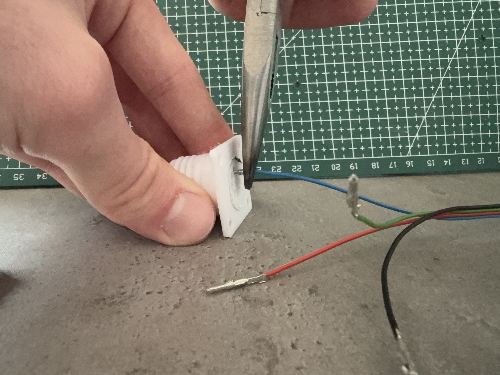

# D38999-3MF


In this repository we developed a MIL-DTL-38999 style
connector system that can be 3D-printed. It was inspired by
[this thing](https://www.thingiverse.com/thing:3129731) by
[fdavies](https://www.thingiverse.com/fdavies/designs). The
connector system uses Molex
[1561](https://www.molex.com/en-us/products/series-chart/1561)
and
[1560](https://www.molex.com/en-us/products/series-chart/1560)
stamped circular crimp contacts. Note this connector system
does not claim full compatibility and compliance with the
standards mentioned. 

## Introduction

MIL-DTL-38999 connectors are widely adopted in the aerospace
industry. You may take a look at the different variants at
leading manufacturers like [Amphenol
Aerospace](https://www.amphenol-aerospace.com/products/mil-dtl-38999-connectors)
or [ITT Cannon](https://www.ittcannon.com/38999-style). A
really common type is the type III variant which features a
triple start thread for mating.

These connectors are durable,
[scoop-proof](https://www.microwaves101.com/encyclopedias/scoop-proof-connectors)
and satisfying to work with. However, they are also very
expensive and thus not an option for small or hobby
projects. This project aims to change that by making these
connectors accessible to a broader audience via additive
manufacturing. Surely these versions will never match the
characteristics of the industrial versions but they make the
D38999 accessible to more people than just industry
branches. 

## Specifications and Features

- 90 unique connector systems in nine different sizes
- M3 bolt holes for mounting of receptacle
- Up to 26 contacts per connector
- Polarized and scoop proof
- 1.25 turns to fully lock
- cheap and accessible contacts $<0.10€$ per contact
- mated length $30mm$
- max footprint $46\times 46 mm$

## Usage

To build a connector system you have to 
1. choose shells, and
2. choose an insert arrangement. 

We will go into more detail of these two steps in the
following sections.

### Shells

Shells are the frames of the connector system that in turn
hold the fixture (insert) that locates the electrical
contacts. They are the outermost part of the connector and
thus are called shells.

The shells are characterized by part numbers in this format:

`D38999-<ST>A<S><XXX><K>`
where
- `D38999` is the connector series code,
- `<ST>` is the shell type,
- `A` is the service class for additive manufacturing
  (choosen by us)
- `<S>` is the size code,
- `<XXX>` is the insert arrangement identifier, and
- `<K>` is the keying code.

The individual parts for the part number are addressed int
he following sections

#### Shell types

There are two shell types supported at the moment: 
- straight plugs (code `26`)
   *A D38999-26ACXXXN
  shell*
- wall mount receptacles (code `20`)
   *A
  D38999-20ACXXXN shell*
  
#### Shell sizes

The shell size determines only the diameter of a
shell. The length i.e. the dimension in direction of the
mating axis is not affected by this. 

The available shell sizes are listed in the following table.
Note that there are military and civil codes for the shell
size. For the shells the military code is used in this repository.

| military code | `A` | `B` | `C` | `D` | `E` | `F` | `G` | `H` | `J` |
| --------------| - | - | - | - | - | - | - | - | - |
| civil code |` 9` | `11` | `13` | `15` | `17` | `19` | `21` | `23` | `25` |

*Different shell size
plugs: size B on the left and size C on the right*

In general larger connectors can hold more electrical contacts.

#### Shell keying

Shells of the same size can have different keying options.
Only plugs and receptacles with matching keying options can
mate.

This mechanically prevents mating of wrong connector pairs.
The behavior is achieved by having five keys or keyways around the plug
or receptacle, respectively, in a unique pattern for every
keying option. Note that the exact pattern can also change depending
on the shell size.

The available keying options are: 

`N, A, B, C, D, E`

Here option `N` is the most common "normal" option.

#### Building shell part numbers

To summarize to build a shell part number you 
1. select the shell type,
2. select the shell size,
3. select the shell keying.

### Inserts

Inserts are the inner parts of the connector system that
locate the electrical contacts. The insert arrangements part
numbers look like this:

`<SZ>-<IA><G>` where
- `<SZ>` is the shell size, 
- `<IA>` is the insert arrangement, and
- `<G>` is the gender.

#### Shell size

The shell size determines which shell sizes the insert can
be used with. It primarily determines the outside diameter
of the insert. 

Currently the following shell sizes (military code with
civilian code in parentheses) have at least one insert
available:

`A(9), B(11), C(13), D(15), E(17), F(19)`

#### Insert arrangement

The insert arrangement determines how the contacts are
arranged in the insert. The code tells you how many contacts
can find place in a insert. 

The following insert arrangements (combined with the shell
size) are available right now

| Insert Arrangement Code | Number of Contacts | 
| ------------------ | -------- |
| 9-1 | 1 |
| 11-4 | 4 |
| 13-8 | 8 |
| 15-12 | 12 |
| 17-18 | 18 |
| 19-26 | 26 |

Where possible standard insert arrangements are used as
specified in MIL-STD-1560C

Development is proceeding for further insert arrangements.
If you would like to contribute, feel free to fork the
repository.

#### Gender

The gender determines whether the insert is designed to hold
pin contacts (Molex 1560, code `P`) or socket contacts
(Molex 1561, code `S`). 

This impacts the length of the insert but any gender of
insert can be installed in any receptacle or plug as long as
the shell size matches. 

In general, the plug that can be moved around gets the socket insert because these
contacts are less exposed and less prone to damage. The
receptacle receives the pin insert.

#### Building insert part numbers

In conclusion, to build a part number of an insert you need
to
1. choose the shell size, 
2. choose how many contacts you need,
3. choose the gender.

Most of the time you'll want to get both genders of an
insert, however.

## Manufacturing and Assembly

There are a few important notices you should follow when
building your connector system. These steps are described in
the following section.

### Manufacturing

Download or export the model files and slice them. We had
good results with 0.2mm layer height. Print the shells in
the orientation shown in the figure below.

*Recommended
printing
orientation for plug, receptacle, and inserts.*

The plug is a two body part that is print in place.

> **IMPORTANT**
> 
> Disable support generation for the plug shell. You will
> not be able to remove the support.

The print time varies and can take up to multiple hours.

### Assembly

After the print is finished remove the parts. You can now
turn the coupling nut on the plug shell to break it loose
from the core. If this does not work right away you can use
a matching receptacle to fix the core in place and get a
better grip on it. 

*Breaking the
coupling nut loose from the plug core.*

Now you clean the insert contact holes with a 2mm drill.
This removes any strings or seams formed during
manufacturing. You may use a cordless drill to speed up the
process. 

*Cleaning
the contact holes with a 2mm drill*

Next, insert the inserts into the shells. Depending on the
fit you may want to glue them in permanently with superglue
or shim them with e.g. a piece of paper.

*Insertion of inserts*

Afterward, crimp the cables/wires with the Molex 1560 or
1561 contacts and insert the contacts into the appropriate
insert depending on the gender. You may use a pair of pliers
here to exert more force but the contact should go in rather
smoothly. Insert the contacts into the insert so far that
the contact is just barely inside of the insert.


*Installing crimp contacts*

> **IMPORTANT**
>
> Due to bad crimping tools we tested the inserts with
> contacts that had their insulation crimp flanges sheared
> of. Your contacts might not fit the insert if the crimp is
> done properly. We are working on updating the inserts. 

> **IMPORTANT**
>
> You may have to deform the back part of the crimp contact
> slightly to make the contact fit into the insert.

At last, you have your completed connector system:
*Completed
connector system*

## Developer Instructions

So you want to have a deeper look into this repository and
how the CAD files are working? We look at two parts here
1. the CAD files,
2. exporting the models.

### CAD files

The CAD files are developed with
[FreeCAD](https://www.freecad.org/) and split into only two
files
1. a file for the receptacle, and
2. a file for the plug

Due to historic reasons (which might change in the future)
the pin inserts are included in the receptacle file and the
socket inserts are included in the plug file. 

The models are parametrized and the shell size and keying
option can be changed by accessing the corresponding attributes of the
`Receptacle_core` or `Plug_core` parts in the property
inspector. Note that keying options vary for shell sizes and
are thus given with the keying code and all applicable shell
sizes afterward. 

The inserts are independent bodies and were designed by
hand. It has now come to our attention that creating the
inserts should also be performed by scripting using a single
tool body for the contact hole and blank bodies for the
default insert shape. 

### Export

You may realize that with the combination of all shell sizes
and the different keying options there are a lot of models
to export. 

To make this easier and less error prone a script was
written that uses the FreeCAD python interpreter to
automatically export all combinations of the connectors. 

To call it execute the following commands from the root of
the repository 

```bash
> cd ./scripts
> freecad.pip install -r requirements.txt
> freecad.cmd exportAll.py
```

The script will then export all models and all inserts in
the following folder structure in the directory `./output`:

```bash
> tree -d ./output
./output/
├── inserts
│   ├── P
│   └── S
├── plugs
│   ├── keying_A
│   ├── keying_B
│   ├── keying_C
│   ├── keying_D
│   ├── keying_E
│   └── keying_N
└── wall_mount_receptacles
    ├── keying_A
    ├── keying_B
    ├── keying_C
    ├── keying_D
    ├── keying_E
    └── keying_N
```

The inserts are split into pin and socket inserts. The
shells are split into the different keying options.

## Credits

This project was inspired by [this
thing](https://www.thingiverse.com/thing:3129731) by
[fdavies](https://www.thingiverse.com/fdavies/designs).
Though the models have been developed independently and the
features have been radically altered.

The standards used for design are 
- [MIL-DTL-38999](http://everyspec.com/MIL-SPECS/MIL-SPECS-MIL-DTL/MIL-DTL-38999M_AMENDMENT-2_57021/)
    - [MIL-DTL-38999/20](https://everyspec.com/MIL-SPECS/MIL-SPECS-MIL-DTL/MIL-DTL-38999_20G_AMENDMENT-2_42842/)
    - [MIL-DTL-38999/26](https://everyspec.com/MIL-SPECS/MIL-SPECS-MIL-DTL/MIL-DTL-38999_26E_302/) 
- [MIL-STD-1560](http://everyspec.com/MIL-STD/MIL-STD-1500-1599/MIL-STD-1560C_CHG-2_56319/)
 
## License

This work is licensed under [CC BY-NC-SA
4.0](https://creativecommons.org/licenses/by-nc-sa/4.0/deed.de).
See `LICENSE`for complete license text.